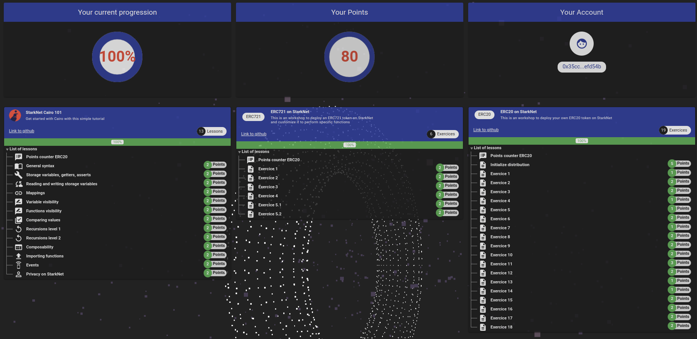

# StarkNet
Here are my solutions of:
 - ERC721 on StarkNet (https://github.com/l-henri/starknet-erc721)
 - ERC20 on StarkNet (https://github.com/l-henri/starknet-erc20)

Try not to copy and paste them

I used [Nile](https://github.com/OpenZeppelin/nile) to compile and deploy the contracts.\
I used the provided python file to convert data to FELT.

It should be possible to compile every contract existing in the Solution folder

